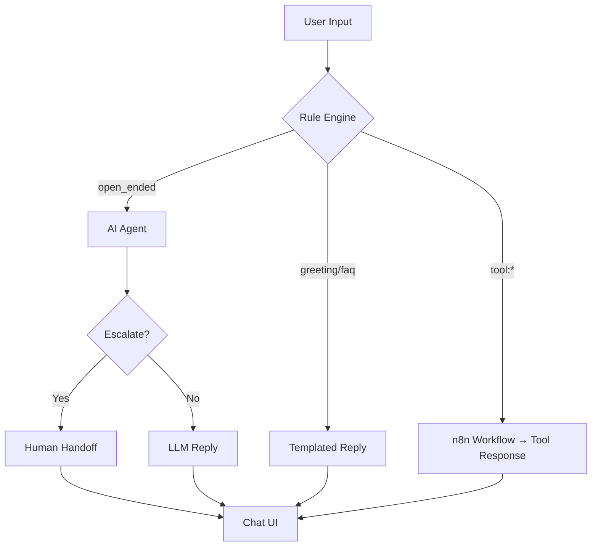

# Architecture Overview

```mermaid
flowchart TD
  U[User Input]
    --> R{Rule Engine}
    R -- greeting/faq --> T[Templated Reply]
    R -- tool:*         --> W[n8n Workflow → Tool Response]
    R -- open_ended     --> A[AI Agent]
    A --> D{Escalate?}
    D -- No  --> L[LLM Reply]
    D -- Yes --> H[Human Handoff]
    H --> M[Human Agent Dashboard]
    L --> M[Chat UI]
    T --> M
    W --> M
```
